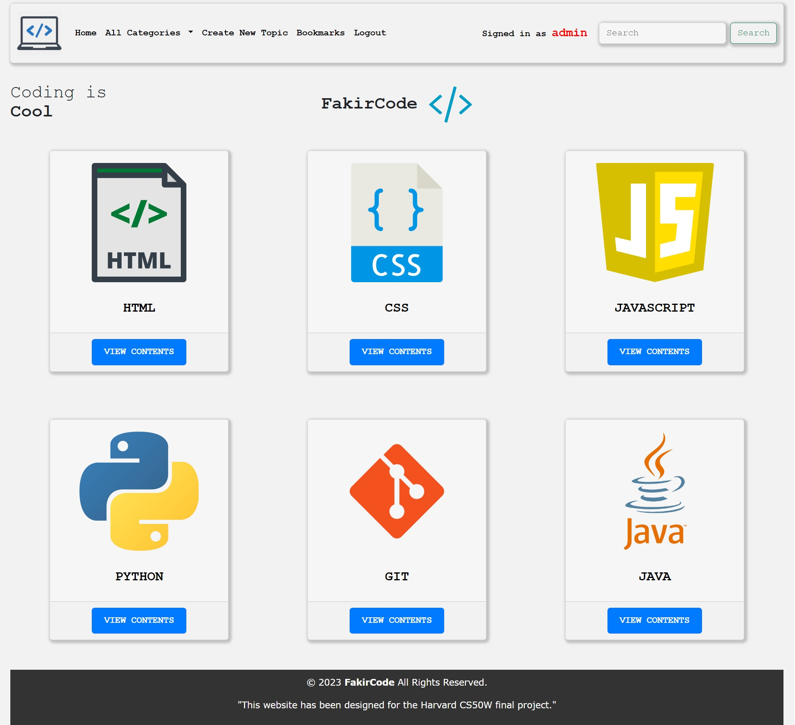
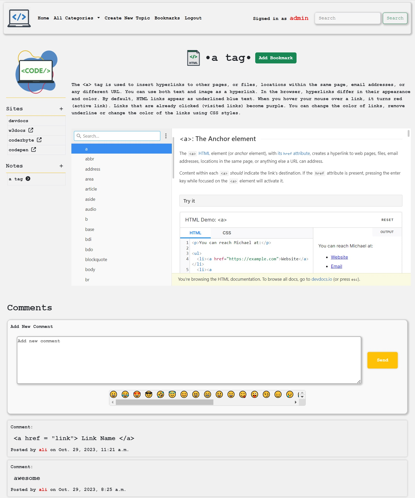
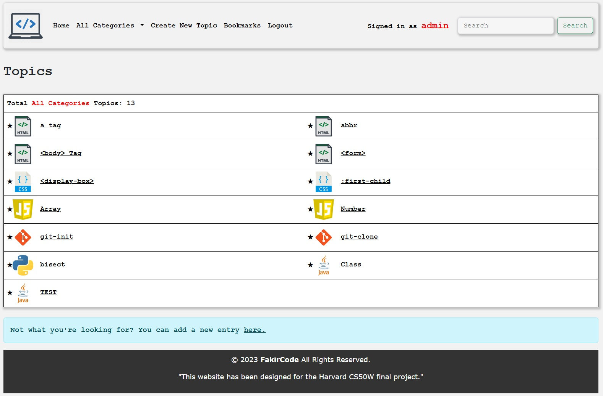

# HARVARD CS50W - FINAL PROJECT

A quick overview of the final assignment(CS50W Final Project) of CS50 Web Programming: Learn to Code Website is a learning platform where individuals can take individual notes, bookmark topics, have multiple sources on a subject together, write separate comments for each topic, have the opportunity to enter data into a category, and add desired topics. In this project; HTML, CSS, JavaScript are used in the frontend, and Python's web framework Django is used in the backend, with SQLITE3 as the database.

# Youtube Video

A short video where I go through the required specifications of the project: https://youtu.be/wxFuMxjSM1k

# Getting Started

- pip install Django
- pip install Pillow
- In your terminal, cd into your project directory.
- If you reset the database, migrations and create superuser
    - Run python manage.py makemigrations network to make migrations for the network app.
    - Run python manage.py migrate to apply migrations to your database.
    - python manage.py createsuperuser
- python manage.py runserver

# What can be done in this project ?

- Users can create accounts.
- Users can log in and log out.
- Categories can only be created by administrators.
- Topics can be created for each category.
- Topics can be listed as "All Categories," or topics specific to each category can be displayed. 
- Descriptions, websites, notes, and comments related to the created topics can be added.
- Added websites are displayed in the left-side site menu. Websites that support iframe usage, like DevDocs, are automatically displayed under the topic description within an iframe. Websites that do not allow iframe usage appear in the left menu as clickable content. Multiple websites can be added to a topic to provide multiple sources. (Added websites can be edited and deleted by administrators.)
- In the "Add New Site" section, website names found between "www" and ".com" or ".net" in the URL are automatically detected and added to the site menu, even if you enter a different word as the site name. (For example: If you enter "abc" as the site name and the website URL is "www.TEST.com," the title added to the left menu will be "TEST").
- Added notes are displayed in the left-side notes menu. Each note is specific to the user who created it, but all notes can be viewed by all logged-in users. Users who are not logged in cannot see notes. Note contents can be edited and deleted by the note owner. The creation date and the creator's information are included in the note content.
- All logged-in users can leave comments under each topic. Users who are not logged in cannot leave comments but can view all comments. Comments can be edited and deleted by the comment author. Comment dates and the author's name are displayed beneath each comment. Comments are automatically sorted, with the newest comment displayed at the top.
- Topics can be added to or removed from bookmarks. All bookmarks can be viewed together, or they can be viewed separately by category.
- Users can search by topic name, and search results are listed.
- Users cannot interact with each other (for example, they cannot follow each other, send private messages, or like/unlike each other's topics and content).

**Note:** This project does not serve any professional purpose; it was created solely for the Harvard CS50W course and inevitably contains bugs. **You can contact me to contribute to the development of this project.**

# Models:

- User: This model is built on Django's built-in AbstractUser and represents the user of the website. It inherits fields and methods to handle user authentication and authorization.
- Category: The Category model represents different categories for organizing content. It has fields for the category name and an optional category image.
- Input: The Input model represents the main content of the website. It includes fields for the title, content, owner (a foreign key to the User model), category (a foreign key to the Category model), an isActive field to indicate if the content is active, and a ManyToMany relationship with User for bookmarks.
- Comment: The Comment model allows users to leave comments on an Input. It includes fields for the author (a foreign key to the User model), the input (a foreign key to the Input model), message content, category (a foreign key to the Category model), and date_posted.
- Site: This model represents external websites related to an Input. It includes fields for the author (a foreign key to the User model), the input (a foreign key to the Input model), category (a foreign key to the Category model), site name, and site URL.
- Note: The Note model allows users to create notes related to an Input. It includes fields for the owner (a foreign key to the User model), the input (a foreign key to the Input model), category (a foreign key to the Category model), title, content, date_posted, and date_modified.

# Functions:

- index: This view function retrieves active Input objects and all Category objects. It then renders the "index.html" template, passing these objects to the template for display.
- search: This view function handles search functionality. It retrieves all Category objects and allows users to search for Input objects based on a query string. The results are displayed in the "search_results.html" template.
- input: This view function displays a single Input along with its associated Category, comments, and notes. Users can also bookmark or leave comments on the Input.
- addSite: Handles the addition of external websites related to an Input. Users can add site names and URLs, and this information is saved in the Site model.
- get_sites: This function returns the list of sites associated with a specific Input in JSON format.
- get_notes: Similar to get_sites, this function returns notes related to a specific Input in JSON format.
- get_comments: Returns comments for a specific Input in JSON format.
- delete_note: Allows users to delete their own notes.
- edit_note: Enables users to edit their notes. If the user is the owner, they can modify the note title and content.
- addNote: Handles the creation of notes related to a specific Input. Users can provide a title and content for the note.
- addComment: Allows users to add comments to a specific Input.
- edit_comment: Lets users edit their own comments. If they're the author, they can change the comment's content.
- delete_comment: Allows users to delete their own comments.
- displayBookmark: This view displays a user's bookmarked Input objects. Users can filter by category, and it handles the removal and addition of bookmarks.
- removeBookmark: Allows users to remove a specific Input from their bookmarks.
- addBookmark: Lets users add a specific Input to their bookmarks.
- displayCategory: Displays Input objects filtered by category. Users can select a specific category to filter the content.
- createInput: Handles the creation of new Input objects. Users can provide a title, content, and category, and it saves this information to the database.
- login_view: Handles user authentication. Users can log in, and if successful, they are redirected to the index page.
- logout_view: Allows users to log out and redirects them to the index page.
- register: Handles user registration. Users can create new accounts by providing a username, email, and password.

These functions and models provide the core functionality for this project, allowing users to organize, comment on, and bookmark coding-related content.

# Images from the project

------------------------------------------------------------------------

------------------------------------------------------------------------

------------------------------------------------------------------------
